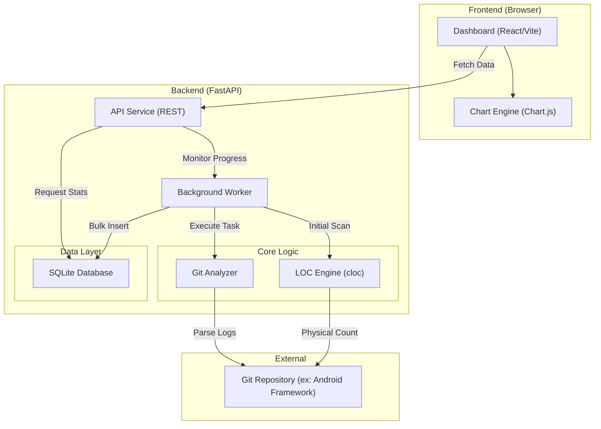

# Implementation Plan: CodeMonitor

Android Framework와 같은 대규모 저장소를 효율적으로 모니터링하기 위한 기술적 설계를 제안합니다.

## User Review Required

> [!IMPORTANT]
> **성능 최적화 및 히스토리 전략**:
> 1. **Initial Scan & Backfill**: `git log --reverse --shortstat`를 분석하여 첫 커밋부터 순차적으로 증감량을 계산, 전체 히스토리를 SQLite에 저장합니다. (CPU 집약적 작업이므로 백그라운드 처리)
> 2. **Current Baseline**: 현재 시점의 정확한 LOC를 위해 `cloc`을 1회 실행하여 보정합니다.
> 3. **Incremental Scan**: 이후 신규 커밋은 `git diff --shortstat`로 실시간 반영합니다.

## Modular Architecture & Implementation Strategy

시스템을 6개의 핵심 모듈로 분리하여 유연성과 유지보수성을 높입니다.

### 1. Git Analyzer & LOC Engine (`backend/core/`)
- **Git Analyzer (`git_analyzer.py`)**: `git log --reverse --numstat` 명령을 사용하여 각 커밋별 `insertions`, `deletions`를 파싱합니다. 제너레이터(Generator)를 통해 메모리 효율을 극대화합니다.
- **LOC Engine (`loc_engine.py`)**: `cloc`을 사용하여 최초 1회 전체 스캔을 수행하고 물리적 라인수 베이스라인을 측정합니다.

### 2. Data Persistence Module (`backend/db/`)
- **역할**: 다중 저장소 정보, 시계열 데이터(TSD) 및 설정 정보 저장.
- **전략**: 
  - `Repositories` 테이블: id, name, path, status, created_at.
  - `History` 테이블: repo_id(FK), timestamp, commit_hash, total_loc.
  - `commit_hash`와 `repo_id` 복합 인덱싱으로 성능 보장.

### 3. Scheduler & Worker Module (`backend/core/worker.py`)
- **역할**: 백그라운드 히스토리 백필 및 주기적 스캔.
- **전략**: FastAPI의 `BackgroundTasks` 또는 `APScheduler`를 사용합니다. 히스토리 백필 진행 상태(`progress_percentage`)를 제공하는 로직을 포함합니다.

### 4. API Service Module (`backend/api/`)
- **역할**: 프론트엔드와 통신하는 RESTful API 엔드포인트.
- **전략**: 
  - `GET /repos`: 등록된 저장소 목록 및 상태 조회.
  - `POST /repos`: 새 저장소 추가 및 백필 작업 예약.
  - `GET /stats?repo_ids=1,2,all`: 특정 저장소 또는 전체 통합 통계 데이터 반환.
  - `GET /status`: 백그라운드 작업 진행 현황 조회.

### 5. Visualization Dashboard (`frontend/`)
- **역할**: 차트 시각화 및 사용자 인터페이스.
- **전략**: `Chart.js`의 `Decimation` 플러그인을 사용하여 대량의 데이터 포인트를 렌더링 최적화하며, 시간 축 줌(Zoom) 기능을 제공합니다.

---

## Architecture Overview



---

## Proposed Changes

### 1. Backend Structure
```text
backend/
├── main.py             # Entry point
├── api/                # API Routes
├── core/               # Business Logic (Git, LOC, Worker)
├── db/                 # Database models & Session
└── utils/              # Common utilities
```

## Verification Plan

### Automated Tests
- `pytest`를 사용하여 소규모 더미 Git 저장소에서 증분 라인수 계산 정확도 검증.

### Manual Verification
1. `backend/main.py` 실행.
2. `http://localhost:8000` 접속 확인.
3. 실제 Android Framework 경로 지정 후 초기 스캔 속도 및 그래프 표시 확인.
